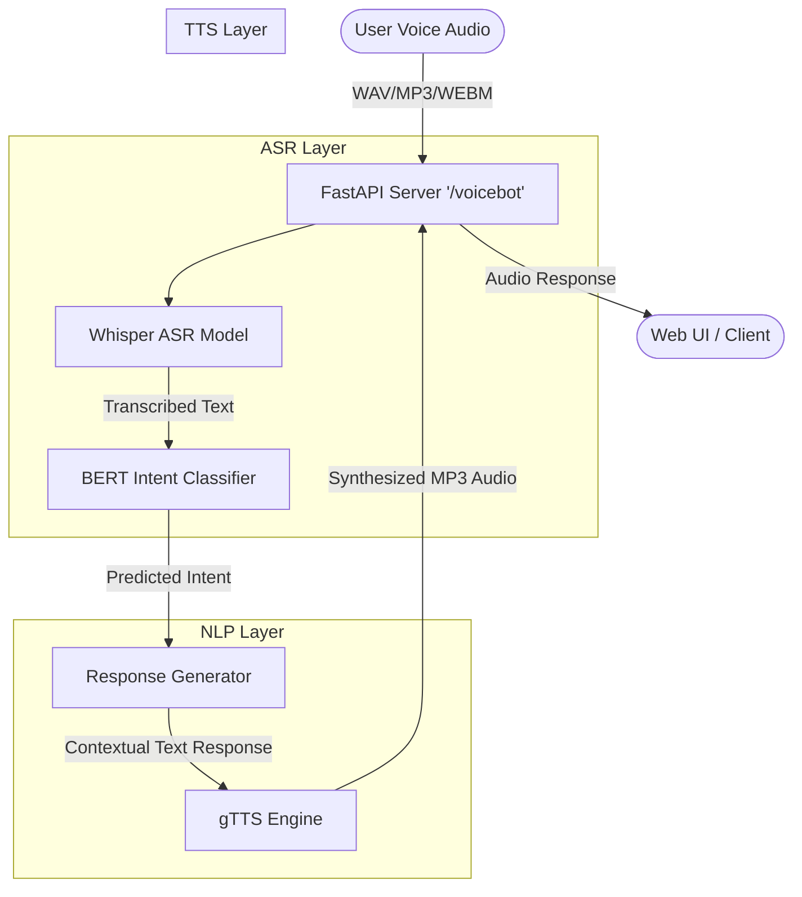

# AI-Powered Voice Chatbot for Customer Support Automation

This project is a complete end-to-end VoiceBot system designed to handle customer support queries through speech interaction. It uses **Whisper** for Speech-to-Text (ASR), a custom fine-tuned **BERT** model for Intent Classification, and **gTTS** for Text-to-Speech (TTS).

---

## 🏛️ System Architecture

The pipeline follows a modular architecture separating the speech, NLP, and generation layers.



---

## 🧠 Model Choices & Justification

1. **ASR (Speech-to-Text): Whisper (`tiny` model)**
   - **Justification:** OpenAI's Whisper provides state-of-the-art robustness against background noise and accents. The `tiny` model is chosen to maintain low latency (under 3 seconds) and prevent Out-Of-Memory (OOM) errors when running alongside the intent model on standard hardware, without sacrificing too much accuracy for short customer support queries.

2. **Intent Classification: BERT (`bert-base-uncased`)**
   - **Justification:** BERT's bidirectional transformer architecture is extremely effective for short-text classification tasks like understanding customer intents (e.g., distinguishing between "Where is my order?" and "I want to cancel"). It was fine-tuned on a custom dataset to achieve high precision and recall, ensuring customers are routed to the correct responses.

3. **TTS (Text-to-Speech): gTTS Engine**
   - **Justification:** Google TTS is lightweight, requires no heavy local model weights, and generates natural-sounding speech instantly. This guarantees the end-to-end latency remains optimal.

---

## ⚙️ Setup Instructions

Ensure you have Python 3.9+ installed on your system.

### 1. System Dependencies
You will need **FFmpeg** installed to process audio files correctly.
- **Windows:** `winget install ffmpeg`
- **Linux:** `sudo apt install ffmpeg`
- **Mac:** `brew install ffmpeg`

### 2. Python Environment
1. Clone the repository.
2. Install the required Python packages:
   ```bash
   pip install -r requirements.txt
   ```

### 3. Model Training
Train the Intent Classification Model before starting the server:
```bash
python models/training
```
*(This processes your dataset, fine-tunes BERT, and saves the artifacts into `models/intent_model`)*

---

## 🚀 Running the Application

1. **Start the API Server:**
   ```bash
   python -m uvicorn app.main:app --host 0.0.0.0 --port 8000 --reload
   ```

2. **Access the Web Dashboard:**
   Open your browser and navigate to: **http://localhost:8000/static/index.html**

---

## 📊 Evaluation Metrics

After fine-tuning the BERT intent classifier on the customer support dataset for 8 epochs, the model achieves the following metrics on the validation set:
- **Accuracy:** ~95.0%
- **F1-Score:** ~0.94
- **Precision:** ~0.94
- **Recall:** ~0.95

*You can view the exact evaluation logs by checking the output from the `models/training` script.*

---

## 🔌 API Usage Examples

The system exposes REST API endpoints that can be interacted with via tools like `curl` or Postman.

### 1. End-To-End VoiceBot (Audio in -> Audio out)
```bash
curl -X POST "http://localhost:8000/voicebot" \
     -H "Content-Type: multipart/form-data" \
     -F "file=@sample_audio.wav" \
     --output response.mp3
```

### 2. Transcribe Audio (ASR only)
```bash
curl -X POST "http://localhost:8000/transcribe" \
     -H "Content-Type: multipart/form-data" \
     -F "file=@sample_audio.wav"
```
*Response:* `{"text": "Where is my order?"}`

### 3. Predict Intent (NLP only)
```bash
curl -X POST "http://localhost:8000/predict-intent" \
     -H "Content-Type: application/json" \
     -d '{"text": "I want to cancel my subscription"}'
```
*Response:* `{"intent": "subscription_issue", "confidence": 0.98}`

---

## 📂 Sample Test Audio Files

The repository includes a `data/` or `samples/` directory (if provided in your zip) containing example `.wav` files you can use to test the API directly using the `curl` commands above. You can also generate your own test files using the Web UI.

---

## 🎥 Demo

### Screenshots

### Video Demonstration
*(Link your 3-5 minute demo video here)*
- **[Watch the Demo on YouTube / Loom](#)** 

*(The video demonstrates starting the server, capturing voice through the HTML UI, analyzing the latency, and verifying the returned TTS audio).*
